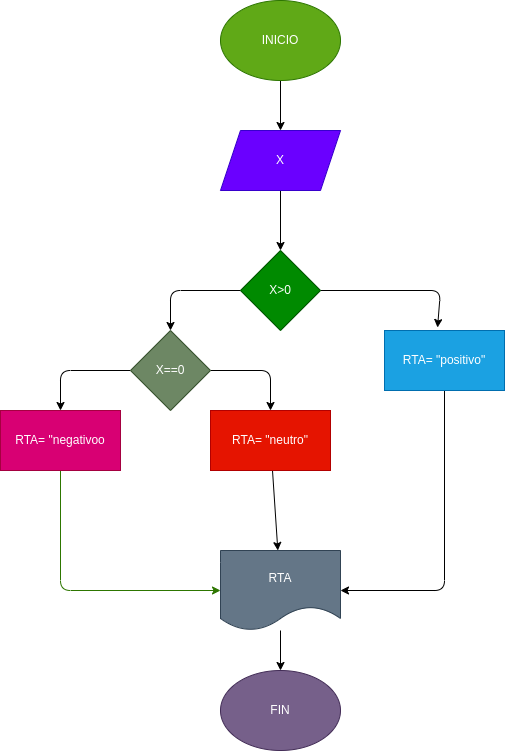

# Ejercicio N.5

## verificar si un numero es positivo o negativo

# ANALISIS

variables  de entrada (imput)

X : numero ingresado

variables de salida (processing,storang,ooutput)

RTA:nos va a decir si es positivo o negativo

# DISEÑO

# CONSTRUCCION